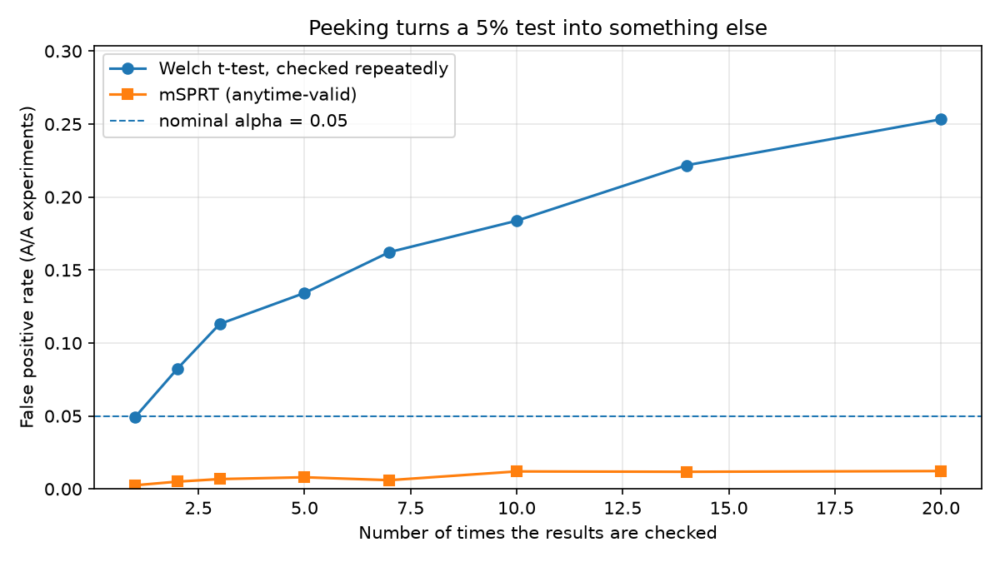

# ab-lab

[](https://github.com/P0w3r223/ab-lab/actions/workflows/ci.yml)

**Designing and analysing A/B experiments — power, tests, bootstrap, SRM and a
sequential test — with every method validated by simulation.**

Most A/B mistakes are not coding mistakes. They are an experiment sized for an
effect nobody would act on, a "significant" result read off a dashboard on day
three, or a comparison whose randomisation was broken before the first user
converted. This package implements the statistics that catch those, and proves
it computes them correctly by running them on thousands of experiments where
the true answer is known.

`statsmodels` appears only in the test suite, as an oracle — implementing these
methods is the point of the project, so wrapping a library that already has
them would defeat it ([ADR 0001](docs/decisions/0001-no-statsmodels-at-runtime.md)).

## The headline result: peeking

Checking a fixed-horizon test repeatedly and stopping at the first significant
reading does not reach the answer faster. It changes the test:

A/A experiments — **no true effect at all** — with 2 000 units per arm, alpha
0.05, 4 000 runs per cell:

| Times the results are checked | Welch t-test (fixed horizon) | mSPRT (anytime-valid) |
|---|---|---|
| 1 | 4.9% (±0.3%) | 0.2% (±0.1%) |
| 2 | 8.2% (±0.4%) | 0.5% (±0.1%) |
| 3 | 11.3% (±0.5%) | 0.7% (±0.1%) |
| 5 | 13.4% (±0.5%) | 0.8% (±0.1%) |
| 7 | 16.2% (±0.6%) | 0.6% (±0.1%) |
| 10 | 18.4% (±0.6%) | 1.2% (±0.2%) |
| 14 | 22.2% (±0.7%) | 1.2% (±0.2%) |
| 20 | **25.3%** (±0.7%) | 1.2% (±0.2%) |

Checked once, the test does what it says: 4.9% against a nominal 5%. Checked
twenty times — a fortnight of glancing at a dashboard morning and evening —
**one A/A experiment in four is declared a winner.**

The p-value is not the only casualty. Among the experiments that *were* stopped
as significant, the reported effect is inflated too, because stopping happens
precisely on the noisy excursions: mean |effect| of 0.175 when peeking against
0.074 with a single look, in a world where the true effect is exactly zero.
Both numbers are false positives; the peeked one claims to be more than twice
as large.



Same data, same alpha, same schedule of looks — the only difference is the
decision rule. Reproduce with `python examples/peeking_pitfalls.py --plot`.

## How do I know this code is right?

Every method is checked twice: against a reference implementation or hand
arithmetic (in `tests/`), and against a simulated world where the truth is
known. The second table is the one that matters, because it tests the choice of
formula and not just its transcription:

10 000 simulated experiments per row, seed 20260721. "MC error" is the standard
error of the empirical rate — the noise floor of the run itself:

| Scenario | Claim | Empirical | MC error | Verdict |
|---|---|---|---|---|
| Welch t-test, A/A (no effect) | = 0.0500 | 0.0538 | ±0.0023 | pass |
| Two-proportion z-test, A/A (no effect) | = 0.0500 | 0.0497 | ±0.0022 | pass |
| Welch t-test, A/B (d = 0.2, n = 400) | = 0.8065 | 0.8077 | ±0.0039 | pass |
| Sample size solved for 80% power (n = 14 745/arm) | = 0.8000 | 0.7929 | ±0.0041 | pass |
| mSPRT, A/A with 10 looks (anytime-valid) | ≤ 0.0500 | 0.0110 | ±0.0010 | pass |

Note the last row's claim. A fixed-horizon test promises its false positive
rate *equals* alpha; an anytime-valid test promises only that it stays *at
most* alpha, and the mSPRT is measurably conservative. The first version of
`examples/validation_table.py` judged it by the equality criterion and reported
correct behaviour as a failure — the fix was to make the claim explicit per row.

Reproduce with `python examples/validation_table.py`.

## Run it in three commands

```bash
python -m venv .venv && source .venv/Scripts/activate   # Windows; use bin/activate elsewhere
pip install -e ".[dev]"
pytest
```

## Using it

**Before the experiment** — how much traffic does this need?

```python
from ab_lab.power import sample_size_for_proportion, mde_for_proportion

design = sample_size_for_proportion(baseline_rate=0.10, mde=0.01, power=0.8)
print(design.per_group)          # 14745 users per arm to see 10.0% -> 11.0%

# The question worth asking when that number is unaffordable:
print(mde_for_proportion(n_per_group=5_000, baseline_rate=0.10).mde)   # 0.0174
# ...at 5k per arm nothing under a 1.74pp lift is visible at all.
```

**When the data arrives** — was assignment even correct?

```python
from ab_lab.srm import check_srm

check = check_srm([100_000, 98_000])
print(check.is_mismatch, check.p_value)   # True 7.0e-06  -> stop, do not read the metric
```

**During the experiment** — may I look at this yet?

```python
from ab_lab.sequential import SequentialMonitor, tau_from_mde

monitor = SequentialMonitor(tau=tau_from_mde(0.01), alpha=0.05)
for day in range(1, 15):
    result = monitor.look(control_so_far, treatment_so_far)
    if result.should_stop:
        break            # this p-value is valid at every look, not just the last
```

**After the experiment** — what is the effect, and how sure am I?

```python
from ab_lab.analyze import welch_t_test, bootstrap_diff
import numpy as np

result = welch_t_test(control, treatment)
print(result.estimate, result.ci, result.p_value)
print(result.assumptions)      # the caveats travel with the number

# For a metric no closed-form test covers - median order value, say:
boot = bootstrap_diff(control, treatment, statistic=np.median, n_resamples=10_000)

# When both arms describe the *same* units - the same users, the same rows scored by
# two models - resample the units, not the arms:
from ab_lab.analyze import paired_bootstrap

paired = paired_bootstrap(before, after)   # between-unit variance cancels
```

## Architecture

```
src/ab_lab/
  results.py     # frozen dataclasses - every public function returns one
  power.py       # design: power_z / power_t core, sample size and MDE on top
  analyze.py     # post-hoc: Welch, two-proportion z, Mann-Whitney, bootstrap (paired and not)
  srm.py         # sample ratio mismatch (chi-square on the allocation)
  sequential.py  # mSPRT: anytime-valid p-values, SequentialMonitor
  simulate.py    # draws + p-value adapters + the A/A / A/B / peeking harness
```

The library never prints and never plots — it returns data. Every table above is
regenerable with one command, and the numeric claims made about the API in this
README are assertions in `tests/`. Rendering lives in `examples/`.

## Technical decisions

| Decision | Why | ADR |
|---|---|---|
| statsmodels as a test oracle, not a dependency | a wrapper proves nothing; unverified hand-rolled statistics prove less | [0001](docs/decisions/0001-no-statsmodels-at-runtime.md) |
| Cohen's h for conversion-rate sample size | one standardised core for every design function, exact agreement with the oracle | [0002](docs/decisions/0002-cohens-h-for-proportion-sample-size.md) |
| mSPRT rather than O'Brien-Fleming boundaries | group-sequential guarantees lapse exactly when the look schedule is not honoured — and dashboards are not a schedule | [0003](docs/decisions/0003-msprt-over-group-sequential.md) |
| Welch by default, not Student | equal variances are an assumption you rarely get to check; Welch costs a fraction of a degree of freedom when they hold | — |
| Pooled variance for the proportion p-value, unpooled for its interval | each is correct under the hypothesis it describes; they can disagree at the margin, and the docstring says so | — |

## What this package will not do for you

- **It assumes independent units.** Metrics with repeated measurements per user
  (sessions, orders) violate that; the variance is understated and every
  interval here is too narrow. Cluster-robust variance is not implemented.
- **The mSPRT is conservative.** Measured false positive rate under ten looks is
  around 1.2% against a nominal 5%. Validity is bought with power, and a
  correctly executed group-sequential design would stop sooner.
- **No multiple-comparison correction across metrics.** Testing one experiment
  against fifteen metrics inflates the error rate the same way peeking does;
  this package measures the peeking case and does not yet cover the other.
- **The bootstrap's p-value has a floor** of `2/(n_resamples+1)`. A "p < 0.001"
  read off a 1 000-resample bootstrap is an artefact.
- **Normal approximations are used for proportions** and are unreliable at very
  low rates with small samples (rule of thumb: at least 10 successes and 10
  failures expected per arm).
- **Sample sizes may differ by a few percent from an online calculator**, which
  usually applies the absolute-difference formula rather than Cohen's h
  ([ADR 0002](docs/decisions/0002-cohens-h-for-proportion-sample-size.md)). For
  the same reason a 1pp *drop* and a 1pp *lift* are not the same experiment:
  from a 2% baseline they need 2 254 and 3 789 units per arm respectively, so
  guardrail metrics have to be sized in the direction they can move
  (`mde_for_proportion(..., direction="decrease")`).

## Roadmap

Tracked as issues labelled `roadmap`:

1. Cluster-robust variance for repeated measurements per user.
2. CUPED variance reduction using a pre-experiment covariate.
3. A worked e-commerce case study: conversion and average order value together,
   ending in a business decision rather than a p-value.
4. Multiple-comparison control across a metric suite.

## License

MIT — see [LICENSE](LICENSE).
