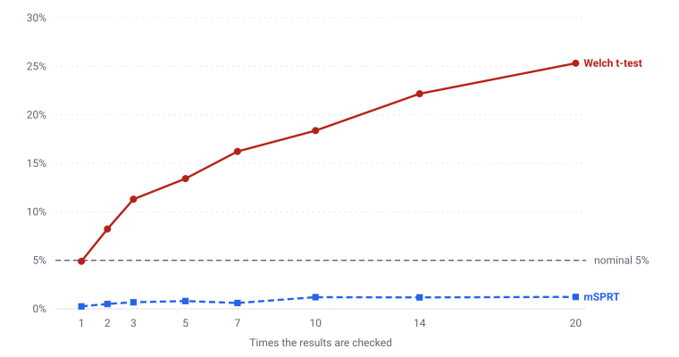

# ab-lab

[](https://github.com/P0w3r223/ab-lab/actions/workflows/ci.yml)

**A 5% test is only 5% if you look once, count each user once, and test one
metric.**

This package measures what each of those three costs — on A/A experiments where
there is no effect to find — and implements the correction for each.
**[Live page →](https://p0w3r223.github.io/ab-lab/)**

Each mechanism at its worst, on A/A data where there is no effect to find:

<!-- generated:mechanisms -->
| At its worst | Nominal | Measured | Correction | After |
|---|---|---|---|---|
| 20 times the results are checked | 5% | **25.3%** | mSPRT (anytime-valid) | 1.2% |
| 20 rows per user | 5% | **44.0%** | Cluster-robust standard error | 5.6% |
| 20 metrics measured at once | 5% | **65.7%** | Holm | 4.9% |
<!-- /generated:mechanisms -->

Three independent routes to the same conclusion, which is what makes it a
finding rather than an anecdote
([ADR 0006](docs/decisions/0006-three-mechanisms-of-alpha-inflation.md)). Every
figure in this README between `generated:` markers is written by
`python -m sitegen.build` from `docs/data/findings.json`, and a test fails if the
committed bytes stop matching.

Most A/B mistakes are not coding mistakes. They are an experiment sized for an
effect nobody would act on, a "significant" result read off a dashboard on day
three, or a comparison whose randomisation was broken before the first user
converted. This package implements the statistics that catch those, and proves
it computes them correctly by running them on thousands of experiments where
the true answer is known.

`statsmodels` appears only in the test suite, as an oracle — implementing these
methods is the point of the project, so wrapping a library that already has
them would defeat it ([ADR 0001](docs/decisions/0001-no-statsmodels-at-runtime.md)).

## The headline result: peeking

Checking a fixed-horizon test repeatedly and stopping at the first significant
reading does not reach the answer faster. It changes the test:

<!-- generated:peeking-preamble -->
A/A experiments - **no true effect at all** - with 2 000 units per arm, alpha 0.05, 4 000 runs per cell:
<!-- /generated:peeking-preamble -->

<!-- generated:peeking -->
| Times the results are checked | Welch t-test (fixed horizon) | mSPRT (anytime-valid) |
|---|---|---|
| 1 | 4.9% (±0.3%) | 0.2% (±0.1%) |
| 2 | 8.2% (±0.4%) | 0.5% (±0.1%) |
| 3 | 11.3% (±0.5%) | 0.7% (±0.1%) |
| 5 | 13.4% (±0.5%) | 0.8% (±0.1%) |
| 7 | 16.2% (±0.6%) | 0.6% (±0.1%) |
| 10 | 18.4% (±0.6%) | 1.2% (±0.2%) |
| 14 | 22.2% (±0.7%) | 1.2% (±0.2%) |
| 20 | **25.3%** (±0.7%) | 1.2% (±0.2%) |
<!-- /generated:peeking -->

Checked once, the test does what it says: 4.9% against a nominal 5%. Checked
twenty times — a fortnight of glancing at a dashboard morning and evening —
**one A/A experiment in four is declared a winner.**

The p-value is not the only casualty. Among the experiments that *were* stopped
as significant, the reported effect is inflated too, because stopping happens
precisely on the noisy excursions: mean |effect| of 0.175 when peeking against
0.074 with a single look, in a world where the true effect is exactly zero.
Both numbers are false positives; the peeked one claims to be more than twice
as large.

<picture>
  <source media="(prefers-color-scheme: dark)" srcset="docs/images/peeking-dark.svg">
  
</picture>

Same data, same alpha, same schedule of looks — the only difference is the
decision rule. The chart is generated SVG rather than an image file, so it
follows the reader's colour scheme and every coordinate in it comes from the
committed record. Reproduce with `python examples/peeking_pitfalls.py`.

## How do I know this code is right?

Every method is checked twice: against a reference implementation or hand
arithmetic (in `tests/`), and against a simulated world where the truth is
known. The second table is the one that matters, because it tests the choice of
formula and not just its transcription:

<!-- generated:validation-preamble -->
10 000 simulated experiments per row, seed 20260721. "MC error" is the standard error of the empirical rate - the noise floor of the run itself:
<!-- /generated:validation-preamble -->

<!-- generated:validation -->
| Scenario | Claim | Empirical | MC error | Verdict |
|---|---|---|---|---|
| Welch t-test, A/A (no effect) | = 0.0500 | 0.0538 | ±0.0023 | pass |
| Two-proportion z-test, A/A (no effect) | = 0.0500 | 0.0497 | ±0.0022 | pass |
| Welch t-test, A/B (d = 0.2, n = 400) | = 0.8065 | 0.8077 | ±0.0039 | pass |
| Sample size solved for 80% power (n = 14 745/arm) | = 0.8000 | 0.7929 | ±0.0041 | pass |
| mSPRT, A/A with 10 looks (anytime-valid) | ≤ 0.0500 | 0.0110 | ±0.0010 | pass |
<!-- /generated:validation -->

Note the last row's claim. A fixed-horizon test promises its false positive
rate *equals* alpha; an anytime-valid test promises only that it stays *at
most* alpha, and the mSPRT is measurably conservative. The first version of
`examples/validation_table.py` judged it by the equality criterion and reported
correct behaviour as a failure — the fix was to make the claim explicit per row.

Reproduce with `python examples/validation_table.py`.

## Run it in three commands

```bash
python -m venv .venv && source .venv/Scripts/activate   # Windows; use bin/activate elsewhere
pip install -e ".[dev]"
pytest
```

## Using it

**Before the experiment** — how much traffic does this need?

```python
from ab_lab.power import sample_size_for_proportion, mde_for_proportion

design = sample_size_for_proportion(baseline_rate=0.10, mde=0.01, power=0.8)
print(design.per_group)          # 14745 users per arm to see 10.0% -> 11.0%

# The question worth asking when that number is unaffordable:
print(mde_for_proportion(n_per_group=5_000, baseline_rate=0.10).mde)   # 0.0174
# ...at 5k per arm nothing under a 1.74pp lift is visible at all.
```

**When the data arrives** — was assignment even correct?

```python
from ab_lab.srm import check_srm

check = check_srm([100_000, 98_000])
print(check.is_mismatch, check.p_value)   # True 7.0e-06  -> stop, do not read the metric
```

**During the experiment** — may I look at this yet?

```python
from ab_lab.sequential import SequentialMonitor, tau_from_mde

monitor = SequentialMonitor(tau=tau_from_mde(0.01), alpha=0.05)
for day in range(1, 15):
    result = monitor.look(control_so_far, treatment_so_far)
    if result.should_stop:
        break            # this p-value is valid at every look, not just the last
```

**After the experiment** — what is the effect, and how sure am I?

```python
from ab_lab.analyze import welch_t_test, bootstrap_diff
import numpy as np

result = welch_t_test(control, treatment)
print(result.estimate, result.ci, result.p_value)
print(result.assumptions)      # the caveats travel with the number

# For a metric no closed-form test covers - median order value, say:
boot = bootstrap_diff(control, treatment, statistic=np.median, n_resamples=10_000)

# When both arms describe the *same* units - the same users, the same rows scored by
# two models - resample the units, not the arms:
from ab_lab.analyze import paired_bootstrap

paired = paired_bootstrap(before, after)   # between-unit variance cancels
```

**When a user appears more than once** — is 5 000 sessions really 5 000
observations?

```python
from ab_lab.cluster import ClusteredSample, cluster_robust_t_test

control = ClusteredSample.from_arrays(session_values, user_ids)
treatment = ClusteredSample.from_arrays(other_values, other_user_ids)

result = cluster_robust_t_test(control, treatment)
# Illustrative, since the numbers depend on your data: at a design effect of 3.7
# a naive interval was sqrt(3.7) too narrow, and 5 000 rows are worth 1 351
# independent observations.
print(result.design_effect, result.effective_n)
print(result.n_clusters)      # below ~40 the estimator is anti-conservative

# And before the experiment, so it is not under-powered on day one:
from ab_lab.cluster import sample_size_for_clustered_mean

design = sample_size_for_clustered_mean(
    mde=0.1, std_dev=1.0, icc=0.3, mean_cluster_size=10
)
print(design.n_clusters_per_group)          # 582 users per arm, not 158
print(design.extra_units_clustering_costs)  # what ignoring it would have cost
```

**When the experiment has more than one metric** — which of these results
survive being asked all at once?

```python
from ab_lab.multiplicity import holm

family = holm(
    [signups.p_value, revenue.p_value, latency.p_value, churn.p_value],
    labels=["signups", "revenue", "latency", "churn"],
)
print(family.error_rate_controlled)   # 'family-wise error rate' - which promise this is
print(family.for_label("revenue"))    # (adjusted p-value, verdict)
print(family.n_rejected)              # how many survive being asked together
```

Naming the members is the point: a correction applied to some of the metrics
while the rest are read raw controls nothing. `benjamini_hochberg` is also
available and controls a *different* thing — the expected share of the
rejections that are false, not the chance of there being one.

**When the metric is a ratio** — clicks over impressions, orders over sessions.

```python
from ab_lab.ratio import RatioSample, ratio_metric_test

control = RatioSample.from_arrays(clicks, impressions, user_ids)
treatment = RatioSample.from_arrays(other_clicks, other_impressions, other_user_ids)

result = ratio_metric_test(control, treatment)
print(result.control_ratio, result.treatment_ratio)
print(result.estimate, result.relative_effect)   # absolute and "+20%", both
```

**Before you buy more traffic** — can last month's data pay for this experiment?

```python
from ab_lab.cuped import CupedSample, cuped_t_test

control = CupedSample.from_arrays(revenue_now, revenue_last_month)
treatment = CupedSample.from_arrays(other_revenue_now, other_revenue_last_month)

result = cuped_t_test(control, treatment)
print(result.variance_reduction)            # 0.49 at a correlation of 0.7
print(result.effective_sample_multiplier)   # 1.97 -> worth twice the traffic
print(result.estimate, result.unadjusted_estimate)   # these should agree
```

The covariate has to be measured **before** the treatment could touch it. One
that the experiment influenced sits on the causal path, and adjusting for it
subtracts part of the effect along with the noise: on a true effect of 0.10, with
half of it leaking into the covariate, the estimate comes back 35% too small and
the rejection rate falls from 80% to 44%. The failure does not look like a false
positive — it looks like a clean null, which is why it survives review
([ADR 0011](docs/decisions/0011-cuped-variance-reduction.md)).

The estimand is the **ratio of totals**, which weights a user by their
denominator — not the mean of per-user ratios, which does not. One user clicking
1 of 1 and another clicking 10 of 100 give 10.9% one way and 55% the other; both
are defensible numbers and only one of them is the click-through rate. Whether
the choice changes your answer is an empirical question about your population,
and [ADR 0010](docs/decisions/0010-ratio-metrics-delta-method.md) measures both
sides of it.

## Architecture

```
src/ab_lab/
  results.py     # frozen dataclasses - every public function returns one
  power.py       # design: power_z / power_t core, sample size and MDE on top
  analyze.py     # post-hoc: Welch, two-proportion z, Mann-Whitney, bootstrap (paired and not)
  srm.py         # sample ratio mismatch (chi-square on the allocation)
  sequential.py  # mSPRT: anytime-valid p-values, SequentialMonitor
  cluster.py     # repeated measurements per user: CR1 sandwich, design effect,
                 # and the sample size that accounts for it
  multiplicity.py # many metrics at once: Bonferroni, Holm, Benjamini-Hochberg
  ratio.py       # metrics that are a ratio of two totals: the delta method
  cuped.py       # variance reduction from a pre-experiment covariate
  simulate.py    # draws + p-value adapters + the A/A / A/B / peeking harness
sitegen/         # renders the page, the tables above and the chart, from
                 # docs/data/findings.json — never simulates, never guesses
```

The library never prints and never plots — it returns data. Every table above is
regenerable with one command, and the numeric claims made about the API in this
README are assertions in `tests/`. Rendering lives in `examples/`.

## Technical decisions

| Decision | Why | ADR |
|---|---|---|
| statsmodels as a test oracle, not a dependency | a wrapper proves nothing; unverified hand-rolled statistics prove less | [0001](docs/decisions/0001-no-statsmodels-at-runtime.md) |
| Cohen's h for conversion-rate sample size | one standardised core for every design function, exact agreement with the oracle | [0002](docs/decisions/0002-cohens-h-for-proportion-sample-size.md) |
| mSPRT rather than O'Brien-Fleming boundaries | group-sequential guarantees lapse exactly when the look schedule is not honoured — and dashboards are not a schedule | [0003](docs/decisions/0003-msprt-over-group-sequential.md) |
| Welch by default, not Student | equal variances are an assumption you rarely get to check; Welch costs a fraction of a degree of freedom when they hold | — |
| Pooled variance for the proportion p-value, unpooled for its interval | each is correct under the hypothesis it describes; they can disagree at the margin, and the docstring says so | — |

## What this package will not do for you

- **Independence is now optional, but you have to ask for it.** The default
  tests assume one observation per unit. Metrics with repeated measurements per
  user (sessions, orders) violate that, and analysed row by row they reject
  32.3% of the time under a true null instead of 5%. `ab_lab.cluster` fixes it —
  but nothing detects the situation for you, and a cluster-robust standard error
  is itself anti-conservative below about forty clusters per arm.
- **The mSPRT is conservative.** Measured false positive rate under ten looks is
  around 1.2% against a nominal 5%. Validity is bought with power, and a
  correctly executed group-sequential design would stop sooner.
- **Nothing decides what "the family" is.** `ab_lab.multiplicity` corrects across
  a set of metrics, but which metrics belong in one family is a judgement, not a
  computation — and correcting a subset while reading the rest uncorrected
  controls nothing at all. The library makes you name the members; it cannot
  make that the right list.
- **The bootstrap's p-value has a floor** of `2/(n_resamples+1)`. A "p < 0.001"
  read off a 1 000-resample bootstrap is an artefact.
- **Normal approximations are used for proportions** and are unreliable at very
  low rates with small samples (rule of thumb: at least 10 successes and 10
  failures expected per arm).
- **Sample sizes may differ by a few percent from an online calculator**, which
  usually applies the absolute-difference formula rather than Cohen's h
  ([ADR 0002](docs/decisions/0002-cohens-h-for-proportion-sample-size.md)). For
  the same reason a 1pp *drop* and a 1pp *lift* are not the same experiment:
  from a 2% baseline they need 2 254 and 3 789 units per arm respectively, so
  guardrail metrics have to be sized in the direction they can move
  (`mde_for_proportion(..., direction="decrease")`).

## Roadmap

Tracked as issues labelled `roadmap`:

The four items this file has carried since 0.1 are done. What is left is what
the ADRs named while deciding *not* to do it yet, which is a different and more
honest kind of list:

1. **A cluster bootstrap**, resampling whole units. It would complete the family
   the package already has two thirds of - independent, paired, clustered
   ([ADR 0008](docs/decisions/0008-cluster-robust-variance.md)).
2. **Compounding the three mechanisms.** Peeking at clustered data, sequential
   testing across a metric suite. The 0.3.0 thesis is that the three are
   independent, not that they compose, and demonstrating composition needs a
   runner that can slice a prefix without cutting a user in half
   ([ADR 0006](docs/decisions/0006-three-mechanisms-of-alpha-inflation.md) D7).
3. **CUPED on a clustered or ratio metric.** It composes with both in principle;
   nothing here has measured it, and
   [ADR 0011](docs/decisions/0011-cuped-variance-reduction.md) says so rather
   than implying the composition is free.

## License

MIT — see [LICENSE](LICENSE).
